# Daily Reflection Tree — Visual Diagram

```mermaid
flowchart TD
    START([START\nGood evening...]) --> A1_OPEN

    subgraph AXIS1["🧭 AXIS 1 — LOCUS: Victim vs Victor"]
        A1_OPEN["Q: One word for today?\nProductive / Tough / Mixed / Draining"]
        A1_D_OPEN{Decision}
        A1_Q1_HIGH["Q: What made it work?\n(Preparation / Adapted / Luck / Others)"]
        A1_Q1_LOW["Q: First move when hard?\n(Find control / Push through / Wait / Stuck)"]
        A1_D_Q1_HIGH{Decision}
        A1_D_Q1_LOW{Decision}
        A1_Q2_INTERNAL["Q: Did you have a choice\nin how you responded?"]
        A1_Q2_EXTERNAL["Q: What made it frustrating?"]
        A1_D_Q2{Signal\nDecision}
        A1_R_INTERNAL["💡 Reflection: You stayed in\nthe driver's seat today."]
        A1_R_EXTERNAL["💡 Reflection: Hard days pull\nattention outward. Where was your hand?"]
    end

    subgraph AXIS2["🤝 AXIS 2 — ORIENTATION: Contribution vs Entitlement"]
        A2_OPEN["Q: Your role in one\ninteraction today?"]
        A2_D_OPEN{Decision}
        A2_Q1_CONTRIBUTION["Q: Did you go beyond\nwhat was required?"]
        A2_Q1_ENTITLEMENT["Q: What's the feeling about\ninput vs return?"]
        A2_Q2_CONTRIBUTION["Q: What drove your contribution?"]
        A2_Q2_ENTITLEMENT["Q: Did you look for a moment\nto give without expectation?"]
        A2_D_Q2{Signal\nDecision}
        A2_R_CONTRIBUTION["💡 Reflection: You gave today —\ninvisible glue that holds teams together."]
        A2_R_ENTITLEMENT["💡 Reflection: Something felt owed.\nWhat do you want to walk in with tomorrow?"]
    end

    subgraph AXIS3["🌍 AXIS 3 — RADIUS: Self-Centric vs Altrocentric"]
        A3_OPEN["Q: Who was in the frame\nduring your biggest challenge?"]
        A3_D_OPEN{Decision}
        A3_Q1_SELF["Q: Did anyone else's\nsituation cross your mind?"]
        A3_Q1_OTHER["Q: What did you do with\nthe awareness of others?"]
        A3_Q2_SELF["Q: Who benefited from\nsomething you did today?"]
        A3_Q2_OTHER["Q: What would a colleague\nsay about your presence?"]
        A3_D_Q2{Signal\nDecision}
        A3_R_ALTROCENTRIC["💡 Reflection: Eyes up —\naware of others, not just yourself."]
        A3_R_SELFCENTRIC["💡 Reflection: Today was mostly your\nown lens. One moment of perspective\nchanges the quality of a day."]
    end

    SUMMARY["📋 SUMMARY\naxis1 + axis2 + axis3 pattern\n+ personalised closing reflection"]
    END([END\nSee you tomorrow.])

    A1_OPEN --> A1_D_OPEN
    A1_D_OPEN -- "Productive / Mixed" --> A1_Q1_HIGH
    A1_D_OPEN -- "Tough / Draining" --> A1_Q1_LOW
    A1_Q1_HIGH --> A1_D_Q1_HIGH
    A1_D_Q1_HIGH -- "Prepared / Adapted" --> A1_Q2_INTERNAL
    A1_D_Q1_HIGH -- "Luck / Others" --> A1_Q2_EXTERNAL
    A1_Q1_LOW --> A1_D_Q1_LOW
    A1_D_Q1_LOW -- "Controlled / Pushed through" --> A1_Q2_INTERNAL
    A1_D_Q1_LOW -- "Waited / Stuck" --> A1_Q2_EXTERNAL
    A1_Q2_INTERNAL --> A1_D_Q2
    A1_Q2_EXTERNAL --> A1_D_Q2
    A1_D_Q2 -- "internal dominant" --> A1_R_INTERNAL
    A1_D_Q2 -- "external dominant" --> A1_R_EXTERNAL
    A1_R_INTERNAL --> BRIDGE_1_2(["🌉 Bridge: From how you responded\n— to what you gave."])
    A1_R_EXTERNAL --> BRIDGE_1_2

    BRIDGE_1_2 --> A2_OPEN
    A2_OPEN --> A2_D_OPEN
    A2_D_OPEN -- "Contributed / Showed up" --> A2_Q1_CONTRIBUTION
    A2_D_OPEN -- "Gave more than got / Waiting" --> A2_Q1_ENTITLEMENT
    A2_Q1_CONTRIBUTION --> A2_Q2_CONTRIBUTION
    A2_Q1_ENTITLEMENT --> A2_Q2_ENTITLEMENT
    A2_Q2_CONTRIBUTION --> A2_D_Q2
    A2_Q2_ENTITLEMENT --> A2_D_Q2
    A2_D_Q2 -- "contribution dominant" --> A2_R_CONTRIBUTION
    A2_D_Q2 -- "entitlement dominant" --> A2_R_ENTITLEMENT
    A2_R_CONTRIBUTION --> BRIDGE_2_3(["🌉 Bridge: From agency and giving\n— now zoom out."])
    A2_R_ENTITLEMENT --> BRIDGE_2_3

    BRIDGE_2_3 --> A3_OPEN
    A3_OPEN --> A3_D_OPEN
    A3_D_OPEN -- "Just me" --> A3_Q1_SELF
    A3_D_OPEN -- "Others in frame" --> A3_Q1_OTHER
    A3_Q1_SELF --> A3_Q2_SELF
    A3_Q1_OTHER --> A3_Q2_OTHER
    A3_Q2_SELF --> A3_D_Q2
    A3_Q2_OTHER --> A3_D_Q2
    A3_D_Q2 -- "other dominant" --> A3_R_ALTROCENTRIC
    A3_D_Q2 -- "self dominant" --> A3_R_SELFCENTRIC
    A3_R_ALTROCENTRIC --> SUMMARY
    A3_R_SELFCENTRIC --> SUMMARY
    SUMMARY --> END
```

## Path Count
- **Total possible paths through the tree:** 8 distinct conversation paths (2 branches × 2 branches × 2 branches)
- **Total nodes:** 36
- **Question nodes:** 10
- **Decision nodes:** 7
- **Reflection nodes:** 6 (2 per axis)
- **Bridge nodes:** 2
- **Summary + End:** 2
- **Start:** 1

## Signal Accumulation Logic

Each question node tagged with a `signal` increments a counter:

| Signal | Increments |
|--------|-----------|
| `axis1:internal` | `state.axis1.internal` |
| `axis1:external` | `state.axis1.external` |
| `axis2:contribution` | `state.axis2.contribution` |
| `axis2:entitlement` | `state.axis2.entitlement` |
| `axis3:other` | `state.axis3.other` |
| `axis3:self` | `state.axis3.self` |

At summary, `dominant` = whichever pole has the higher count. The closing reflection is selected from `summaryTemplates.closingReflections` using the key `{axis1.dominant}+{axis2.dominant}+{axis3.dominant}` — giving 8 distinct personalised endings.
